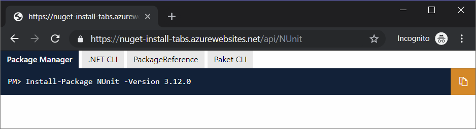

# NuGet Install Tabs

> Embed the NuGet package installation instructions in your open source project website

Embed an `iframe` and provide the `PackageId` as the slug of the `src`:

```html
<iframe src="https://nuget-install-tabs.azurewebsites.net/api/<PackageId>"></iframe>
```

Style the `iframe` to remove borders and set the appropriate size:

```html
style="border-style:none; width:750px; height:112px;"
```

:warning: The `iframe` tag is not allowed with [GitHub Flavored Markdown](https://github.github.com/gfm/), so this will not work in your `README.md`

## :information_desk_person: Example

Example with [NUnit](https://www.nuget.org/packages/NUnit/):

https://hlaueriksson.github.io/NuGetInstallTabs/

```html
<iframe src="https://nuget-install-tabs.azurewebsites.net/api/NUnit" style="border-style:none; width:750px; height:112px;"></iframe>
```



## :open_book: Further reading

Read more about how to [install and manage NuGet packages](https://docs.microsoft.com/en-us/nuget/consume-packages/install-use-packages-visual-studio)
