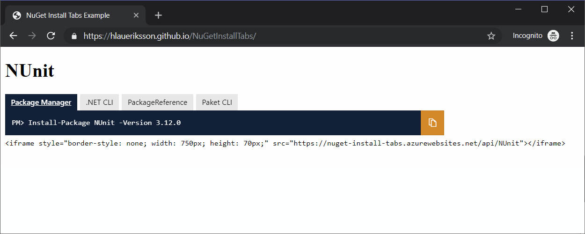

# NuGet Install Tabs

> Embed the NuGet package installation instructions in your open source project website

- [HTML](#html)
- [Markdown](#markdown)
- [Further reading](#further-reading)

## HTML

Embed an `iframe` and provide the `PackageId` as the slug of the `src`:

```html
<iframe src="https://nuget-install-tabs.azurewebsites.net/api/<PackageId>"></iframe>
```

Style the `iframe` to remove borders and set the appropriate size:

```html
style="border-style:none; width:750px; height:112px;"
```

:warning: The `iframe` tag is not allowed with [GitHub Flavored Markdown](https://github.github.com/gfm/), so this will not work in your `README.md`

### Example

:information_desk_person: Example with [NUnit](https://www.nuget.org/packages/NUnit/):

https://hlaueriksson.github.io/NuGetInstallTabs/

```html
<iframe src="https://nuget-install-tabs.azurewebsites.net/api/NUnit" style="border-style:none; width:750px; height:112px;"></iframe>
```



## Markdown

Browse to the URL with a `PackageId`:

`https://nuget-install-tabs.azurewebsites.net/api/<PackageId>/markdown/`

Copy and paste the markdown!

:white_check_mark: The markdown is valid [GitHub Flavored Markdown](https://github.github.com/gfm/), so this will work great in your `README.md`

### Example

:information_desk_person: Example with [NUnit](https://www.nuget.org/packages/NUnit/):

https://nuget-install-tabs.azurewebsites.net/api/NUnit/markdown/

```markdown
| NuGet            |       | [![NUnit][1]][2]                                        |
| :--------------- | ----: | :------------------------------------------------------ |
| Package Manager  | `PM>` | `Install-Package NUnit -Version 3.12.0`                 |
| .NET CLI         | `>`   | `dotnet add package NUnit --version 3.12.0`             |
| PackageReference |       | `<PackageReference Include="NUnit" Version="3.12.0" />` |
| Paket CLI        | `>`   | `paket add NUnit --version 3.12.0`                      |

[1]: https://img.shields.io/nuget/v/NUnit.svg?label=NUnit
[2]: https://www.nuget.org/packages/NUnit
```


## Further reading

:open_book: Read more about how to [install and manage NuGet packages](https://docs.microsoft.com/en-us/nuget/consume-packages/install-use-packages-visual-studio)
